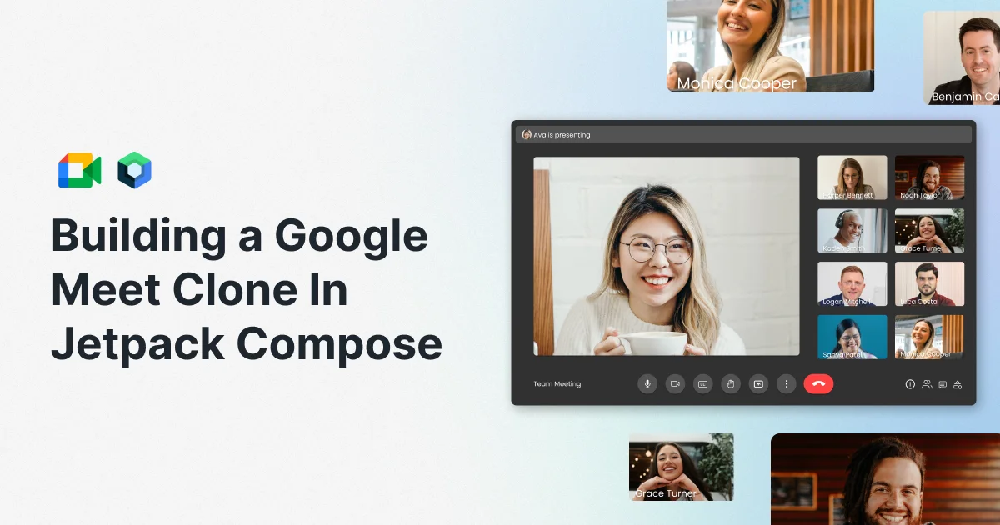
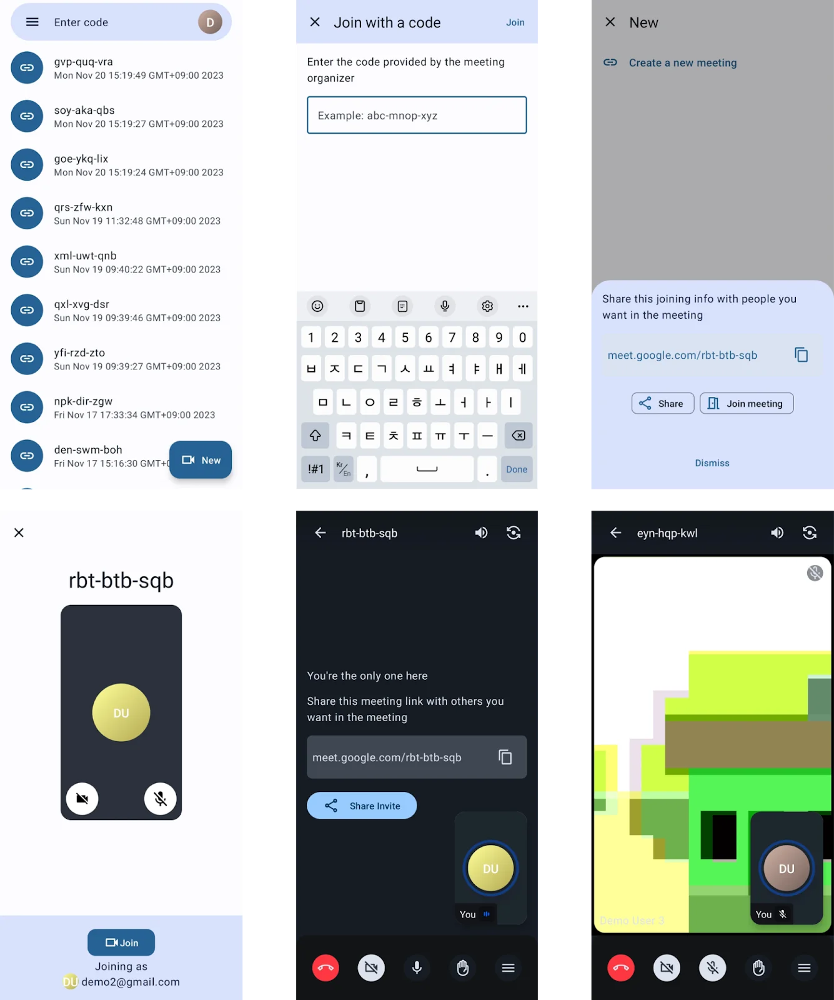

# Google Meet Clone



## Blog📝

[Building a Google Meet Clone In Jetpack Compose](https://getstream.io/blog/google-meet-clone)

## Application 🚀

[](https://github.com/workspace/google-meet-clone-compose/releases/download/v1/app-release.apk)

This project's application can be used with Stream's official demo web. Use call's id along with the following link format.

```shell
https://getstream.io/video/demos/join/{call-id}
```

## Features

[](https://www.figma.com/file/jcSLfuzfjBPMXRWagOt0Bc/Google-Meet-Clone-User-Flow)

- Meeting room list screen
- Joining a meeting with a room id
- Creating a new meeting room
- Lobby screen
- Real-time meeting room

## Screenshots 📱



## Tech Stacks 🛠

- [Video Call SDK from Stream](https://getstream.io/video/sdk/android?utm_source=Github&utm_medium=Github_Repo_Content_Ad&utm_content=Developer&utm_campaign=Github_Jan2024_GoogleMeetAndroidClone&utm_term=extWriterOss)
- Kotlin
  - Flow
  - Coroutines
  - Serialization
- Jetpack
  - Compose
  - Lifecycle
  - ViewModel
- Retrofit2
